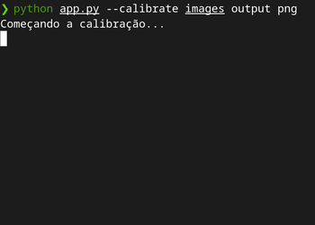

# OpenCV Classes

I am teaching a portuguese student to use [OpenCV](https://opencv.org/) in a small project.

This is a personal and well-commented set of scripts that might be useful for people with some computer vision knowledge getting into OpenCV.

The motivating project is an augmentation program that, upon detection of movie posters on a webcam, displays the movie title and a set of cubes representing its score (1 to 5).

Mind that if your webcam has low resolution, the image matching will work better for images with lower resolution. In other words, if the level of detail your camera can capture is low, the generation of keypoints for each image should consider the same level of detail.

You will just need Python 3.6+ and `pip3 install opencv-contrib-python` to run every script.

Fore more usage information, clone this repository and run `python app.py -h`

| File        | Content           | Status |
| ----------- |-------------| -----|
| `calibration/simple-calibration.py`    | Image calibration functions and a side-by-side view of the original and calibrated images | :heavy_check_mark: |
| `calibration/complete-calibration.py`  | Same as above but with a cube rendered on top of the calibrated image | :heavy_check_mark: |
| `calibration/calibration.py`  | Same as `calibration/simple-calibration.py` but keypoints and descriptors are generated for each poster and relevant information is saved to a JSON file | :heavy_check_mark: |
| `coeff.yml`| File with calibration values for my camera, generated by the scripts above | :heavy_check_mark: |
| `db.json`| File with the path for each poster image, their shape, generated keypoints and descriptors, as well as their title and rating | :heavy_check_mark: |
| `detection/detect-images-simple.py`| Recognizes an image from a calibrated camera capture | :heavy_check_mark: |
| `detection/detect-images-complete.py`| Same as above but the camera image is replaced by the detected poster image with title and cubes representing the movie rating | :heavy_check_mark: |
| `detection/detection.py`| Same as `detect-images-simple.py` but the title and cubes representing the movie rating appear on top of the detected poster | :heavy_check_mark: |
| `app.py`| Calls the functions defined above with CLI help and information | :heavy_check_mark: |

Calibration References:
 - https://docs.opencv.org/3.1.0/dc/dbb/tutorial_py_calibration.html
 - https://docs.opencv.org/2.4/modules/calib3d/doc/camera_calibration_and_3d_reconstruction.html
 - https://docs.opencv.org/master/d7/d53/tutorial_py_pose.html

Detection References:
 - https://www.geeksforgeeks.org/detect-an-object-with-opencv-python/
 - https://docs.opencv.org/3.4/d5/d6f/tutorial_feature_flann_matcher.html
 - https://opencv-python-tutroals.readthedocs.io/en/latest/py_tutorials/py_feature2d/py_orb/py_orb.html
 - https://blog.francium.tech/feature-detection-and-matching-with-opencv-5fd2394a590

Augmentation References:
 - https://bitesofcode.wordpress.com/2018/09/16/augmented-reality-with-python-and-opencv-part-2/
 - https://github.com/juangallostra/augmented-reality
 - https://github.com/anshul-16/perspective-homography-opencv
